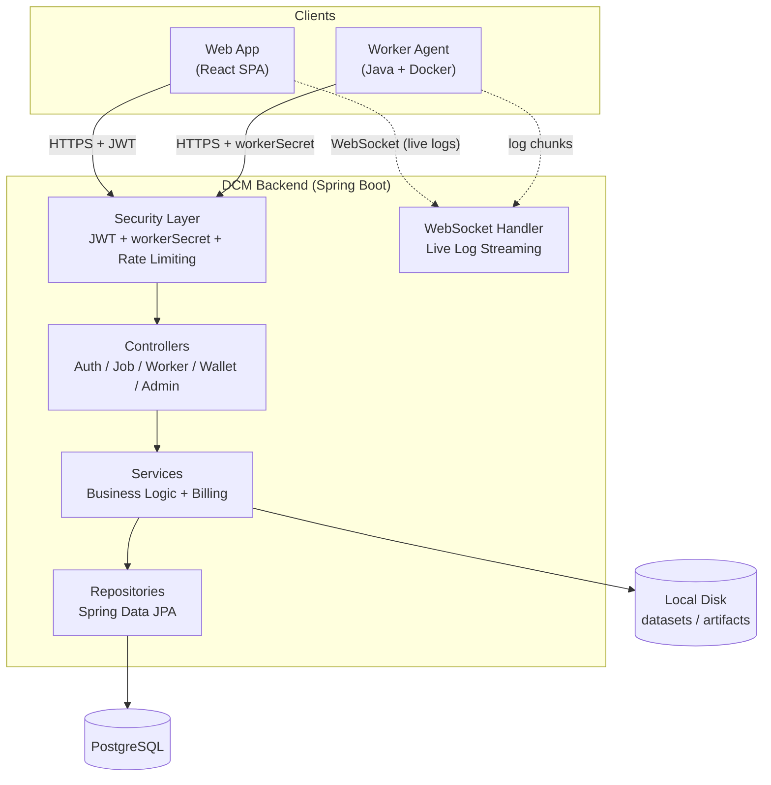
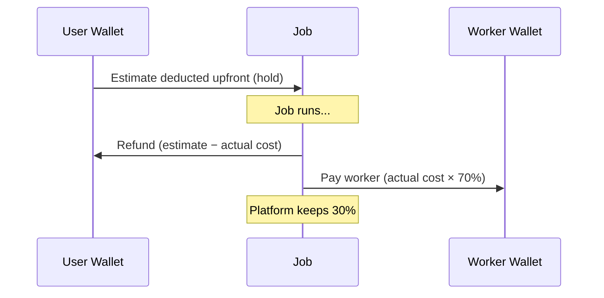
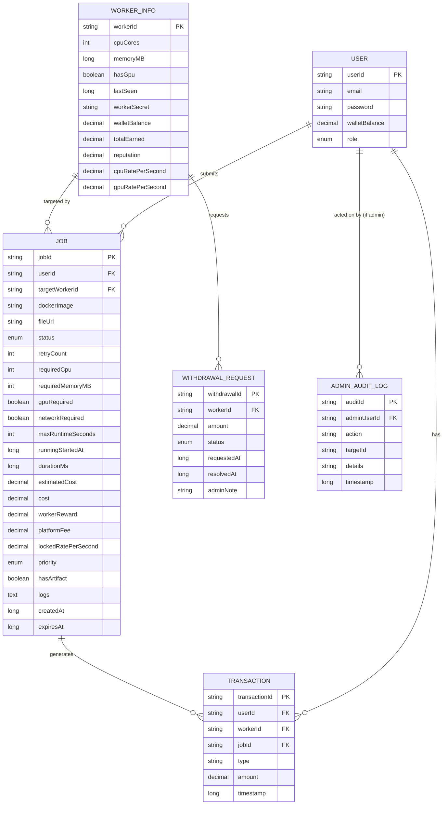
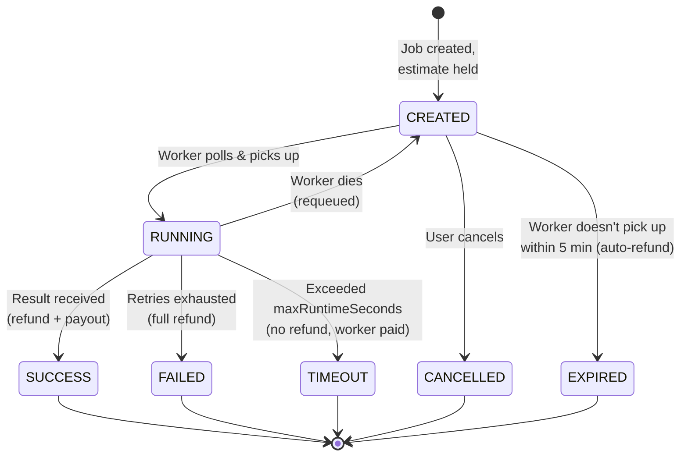

# DCM Backend — Distributed Compute Marketplace API


The backend API for **DCM (Distributed Compute Marketplace)** — a platform where developers and students submit machine learning training jobs to a network of independent compute providers ("workers"), and pay only for the compute-seconds they actually use.

Think of it as **Uber for ML training**: a job submitter picks a specific worker from a live marketplace (by price, specs, and reputation), the job runs in an isolated Docker container on that worker's machine, and payment settles automatically based on real runtime.

---

## Table of Contents

- [Architecture](#architecture)
- [Core Design Concepts](#core-design-concepts)
- [Tech Stack](#tech-stack)
- [Features](#features)
- [Database Schema](#database-schema)
- [Job Lifecycle](#job-lifecycle)
- [Getting Started](#getting-started)
- [Environment Variables](#environment-variables)
- [API Overview](#api-overview)
- [Security](#security)
- [Testing](#testing)
- [Project Structure](#project-structure)
- [Known Limitations & Roadmap](#known-limitations--roadmap)

---

## Architecture



### Layered Request Flow

```
HTTP Request
    │
    ▼
JwtAuthFilter / workerSecret validation
    │
    ▼
Controller  (thin — request/response only)
    │
    ▼
Service     (business logic, billing, validation)
    │
    ▼
Repository  (Spring Data JPA)
    │
    ▼
PostgreSQL
```

---

## Core Design Concepts

**1. Worker-Targeted Jobs, Not Open Polling**
Since workers set their own prices, a job isn't broadcast to any available worker — it's created *for a specific worker* (`targetWorkerId`), chosen by the user from the marketplace. The worker's current rate is **locked into the job at creation time**, so later price changes never affect jobs already in flight.

**2. Pre-Deduction Billing with Automatic Refunds**


**3. Runtime Plausibility Checks**
Billing is calculated directly from worker-reported `durationMs`. The backend cross-checks this against real wall-clock time elapsed since the job started running (`runningStartedAt`), rejecting results that claim runtime beyond what's physically possible — closing a real self-reporting exploit.

---

## Tech Stack

| Layer | Technology |
|---|---|
| Language | Java 17 |
| Framework | Spring Boot 3.5 |
| Security | Spring Security, JWT (jjwt), BCrypt |
| Persistence | Spring Data JPA, PostgreSQL, Flyway |
| Rate Limiting | Bucket4j |
| Real-time | Spring WebSocket |
| Build | Maven |
| Containerization | Docker, Docker Compose |

---

## Features

### Authentication & Authorization
- JWT-based auth with role claims (`USER` / `ADMIN`)
- BCrypt password hashing
- Server-side token revocation on logout (in-memory, per-user)
- Separate `workerSecret` authentication scheme for worker agents (never mixed with user JWTs)

### Wallet & Billing
- Pre-deduction at job creation, automatic refund of unused estimate
- Worker-set, per-worker CPU/GPU pricing — locked into each job at creation
- Priority multipliers (`LOW` 0.8× → `URGENT` 2×)
- Full transaction ledger (deposits, holds, costs, refunds, payouts, withdrawals)
- Worker withdrawal requests with admin approval workflow

### Job Lifecycle
- Targeted worker assignment with 5-minute pickup expiry (auto-refund if unclaimed)
- Retry logic (configurable `maxRetries`) before permanent failure
- Hard execution timeout with SIGTERM → grace period → SIGKILL
- Runtime plausibility validation against server-tracked wall-clock time
- Job cancellation (while still unclaimed)
- Downloadable output artifacts and logs

### Worker Management
- Heartbeat-based online/offline detection with dead-worker job recovery
- Startup recovery — reconciles worker state after a backend restart
- Reputation scoring (starts neutral at 50/100, adjusts on success/failure/timeout)

### Admin
- Platform-wide stats, job/worker/user management
- Force-fail stuck jobs, ban misbehaving workers
- Withdrawal approval/rejection
- **Full audit log** of every admin action (who, what, when)

### Platform Hardening
- Rate limiting on login, registration, job creation, deposits, file uploads, and worker polling
- Input validation (Bean Validation) across all request DTOs
- Structured logging (SLF4J)
- Paginated list endpoints (jobs, transactions, admin tables)

---

## Database Schema



---

## Job Lifecycle



---

## Getting Started

### Prerequisites
- Java 17+
- Maven 3.9+
- PostgreSQL 16+ (or use Docker Compose — see below)
- Docker (required by workers, not by the backend itself)

### Option A — Local (no Docker)

```bash
# 1. Create the database
createdb dcm

# 2. Set required environment variables
export JWT_SECRET=$(openssl rand -base64 64)

# 3. Run
mvn spring-boot:run
```

Flyway migrations run automatically on startup — no manual schema setup needed.

### Option B — Docker Compose (recommended)

From the repo root (one level above this backend folder, alongside a sibling `dcm-frontend/` folder):

```bash
JWT_SECRET=$(openssl rand -base64 64) docker-compose up --build
```

This brings up PostgreSQL, the backend, and the frontend together. See the root `docker-compose.yml` for the full service definitions.

### Creating the First Admin

Admins are never self-registered — promote a user manually:

```sql
UPDATE users SET role = 'ADMIN' WHERE email = 'you@example.com';
```
Log out and back in afterward — the JWT's role claim is only refreshed on a new login.

---

## Environment Variables

| Variable | Default | Description |
|---|---|---|
| `JWT_SECRET` | (dev fallback string) | Signing key for JWTs — **must** be set explicitly outside local dev |
| `JWT_EXPIRATION_MS` | `86400000` (24h) | Token lifetime |
| `SPRING_DATASOURCE_URL` | `jdbc:postgresql://localhost:5432/dcm` | Database connection |
| `SPRING_DATASOURCE_USERNAME` | `postgres` | DB user |
| `SPRING_DATASOURCE_PASSWORD` | `admin` | DB password |
| `APP_BASE_URL` | `http://localhost:8080` | Used to build public file-download URLs |

---

## API Overview

| Group | Example Endpoints |
|---|---|
| Auth | `POST /user/register`, `POST /user/login`, `POST /user/logout` |
| Wallet | `GET /wallet`, `POST /deposit`, `GET /users/transactions` |
| Jobs (user) | `POST /jobs/create`, `GET /jobs`, `GET /jobs/{id}`, `GET /jobs/{id}/logs`, `GET /jobs/{id}/artifact`, `POST /jobs/{id}/cancel` |
| Jobs (worker) | `GET /jobs/poll/{workerId}`, `POST /jobs/result`, `POST /jobs/fail`, `POST /jobs/timeout`, `POST /jobs/artifact` |
| Workers | `POST /register`, `POST /workers/heartbeat`, `GET /workers`, `PUT /workers/rate`, `POST /workers/withdraw` |
| Admin | `GET /admin/stats`, `GET /admin/jobs`, `POST /admin/jobs/{id}/force-fail`, `POST /admin/workers/{id}/ban`, `GET /admin/audit-log` |
| Real-time | `ws://.../ws/jobs/{jobId}` — live log streaming (JWT via query param) |

Full request/response schemas and a Postman-ready testing guide are maintained separately in the project's API documentation.

---

## Security

| Feature | Implementation |
|---|---|
| Password storage | BCrypt |
| Session tokens | JWT, HMAC-signed, with server-side revocation on logout |
| Worker authentication | Separate `workerSecret` scheme, BCrypt-hashed at rest |
| Rate limiting | Bucket4j — login, register, job creation, deposits, file uploads, worker polling |
| Input validation | Jakarta Bean Validation on all request DTOs |
| Result tamper-resistance | Server-side wall-clock plausibility check on reported job runtime |
| Admin accountability | Every force-fail, ban, and withdrawal decision is recorded in `admin_audit_log` |
| CORS | Explicit allowlist (dev: `localhost:5173`) |

**Not yet implemented** (see [Roadmap](#known-limitations--roadmap)): HTTPS/TLS, encryption at rest, verifiable computation.

---

## Testing

```bash
mvn test
```

Current coverage focuses on the highest-risk logic:
- `BillingServiceTest` — pure billing math, priority multipliers, refund calculation
- `AuthServiceTest` — registration conflicts, password verification, token issuance
- `WalletServiceTest` — pre-deduction, refunds, withdrawal balance checks
- `JobServiceTest` — creation validation, worker assignment, retry/failure logic, cancellation rules

---

## Project Structure

```
src/main/java/com/dcm/backend/demo/
├── config/            # CORS, WebSocket config
├── controller/         # Thin HTTP layer
├── service/            # Business logic, billing, wallet, admin
├── repository/         # Spring Data JPA interfaces
├── dto/
│   ├── entity/          # JPA entities
│   ├── request/         # Incoming request DTOs
│   └── response/        # Outgoing response DTOs
├── security/            # JWT filter, JwtUtil, SecurityConfig
├── websocket/           # Live log streaming handler + handshake auth
├── scheduler/           # Dead-worker recovery, job expiry
├── exception/           # Custom exceptions + global handler
└── enums/               # JobStatus, Priority, Role, WithdrawalStatus

src/main/resources/
├── db/migration/        # Flyway SQL migrations
├── static/downloads/    # Worker agent distributable
└── application.properties
```

---

## Known Limitations & Roadmap

**Deliberately deferred, not forgotten:**
- HTTPS/TLS (needs a real domain — pending public deployment)
- Encryption at rest for datasets/artifacts
- Payment gateway integration (deposits are currently simulated)
- Stronger sandboxing (gVisor/microVM tier) beyond current Docker hardening
- Multi-worker distributed training
- Verifiable computation (currently only runtime *plausibility*, not proof of genuine work)

---

## License

MIT
